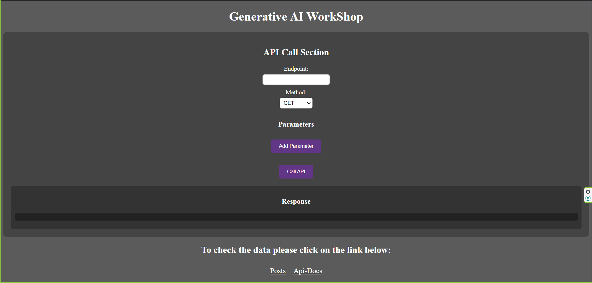

## Quickstart

### Installation

1. Install dependencies:
  ```sh
  npm i
  ```

### Running the Application

To start the application, run:
```sh
npm run dev
```

This will start both the frontend and backend servers.

### Swagger UI

You can access the front-end site at :
```
http://localhost:8080/
```

&nbsp;
&nbsp;

You can access the Swagger UI documentation at:
```
http://localhost:8080/api-docs
```

&nbsp;
&nbsp;

## Nodejs server built and maintained by [Milan Sachani &#x1F49C;](https://milansachani.dev)
